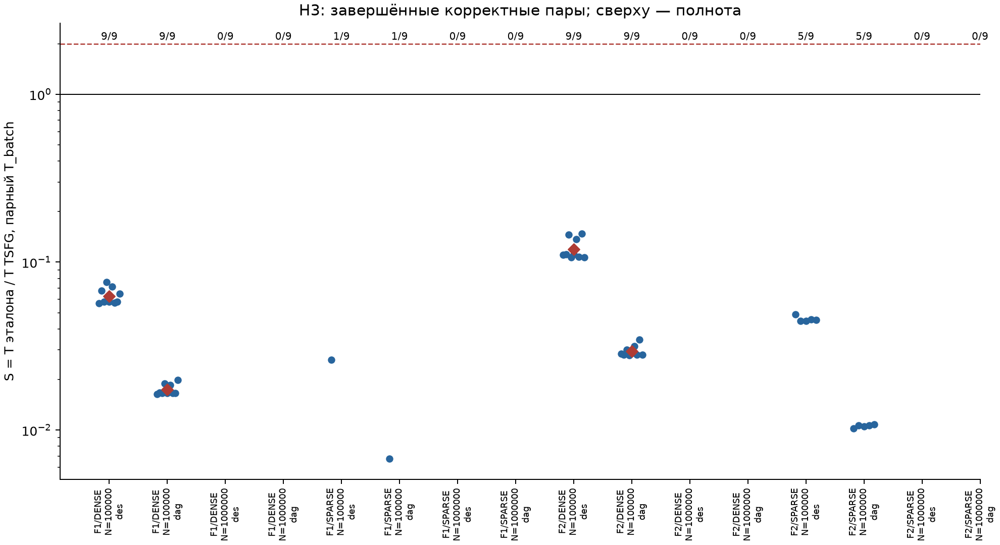
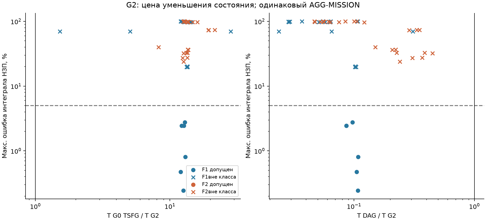
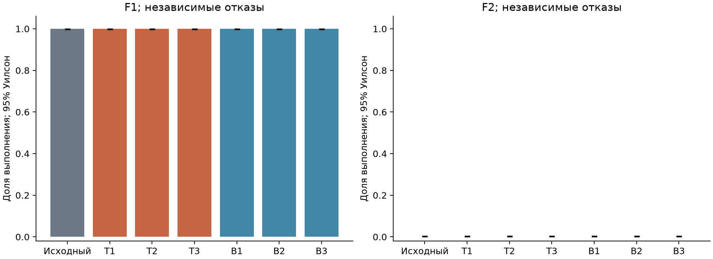

# TSFG: проверка исполнения производственного расписания

Итог фактически выполненной кампании 26–27 сентября 2026 года. Все исполнения, измерения и построение этого отчёта выполнены в GitHub-hosted Actions.

## Основные результаты

DES-REF и DAG-REF — наши независимые открытые исследовательские реализации. DAG-REF рассчитывает исполнение по графу технологических зависимостей и фиксированных очередей станков. Коммерческие BFG и PlantTwin в этой кампании не запускались; коэффициенты ниже не описывают их производительность.

Точный пооперационный профиль прошёл Mk01 и независимые проверки опубликованных больших траекторий. Это подтверждает корректность на проверенных данных; вычислительное преимущество оценивается отдельно.

H3: из 16 решений по семейству, плотности, размеру и эталону ускорение подтверждено в 0, не подтверждено при полной серии в 4; для 12 недостаточно завершённых корректных пар. Последняя категория не заменяется положительным или отрицательным результатом.

G2 прошёл весь допуск состояния к сроку на 6 из 48 доступных наборов. Среди допущенных наборов время G2 меньше времени пооперационного TSFG на 6, DES — на 2, DAG — на 0. Это описательные K=11, а не парный критерий H3; точность полного срока проверяется отдельным классом DIAGNOSTIC.

Изолированное сравнение памяти не получено: счётчик RSS включает историю запуска до exec. Оценка резервов относится к заданным сериям отказов; постоянные исходы выполнения ограничивают её информативность. Непроведённые проверки и отклонения перечислены в конце отчёта.

## Ответ на вопрос о корректности и кейсе Ozon

На проверенном точном профиле исходное ядро S1 с пооперационным адаптером даёт те же результаты, что независимые DES и DAG. Найдены и исправлены накладные расходы адаптера: повторное форматирование идентификаторов, выделение списка завершений и обслуживание остатка горизонта после полного выполнения.

В парном аудите N=10000, K=100 исправление сократило время на 31–32%. Все 2000 непрофилированных траекторий совпали по обязательным индивидуальным полям. Исходные файлы S1 не изменялись.

Исходный Ozon healthy_100k воспроизведён с тем же отпечатком и восемью совпадениями метрик в двух запусках. Исторические 2,8–7,4× — аналитическая оценка scheduling-work, а не измеренное отношение времени TSFG к производственному DES. Пооперационная постановка сохраняет индивидуальные назначения, предшественников и фиксированные очереди. Потоковая модель Ozon обслуживает агрегированные объёмы. Одинаковая прикладная цель не делает эти вычислительные модели эквивалентными.

| F1/F2, K=100 | Старый адаптер, с | Исправленный, с | DES, с | DAG, с |
|---|---|---|---|---|
| F1 | 26,78 / 26,90 | 18,18 / 18,15 | 0,84 / 0,84 | 0,28 / 0,29 |
| F2 | 18,02 / 17,89 | 12,46 / 12,47 | 0,93 / 0,94 | 0,29 / 0,29 |

В первом G2 отдельно обнаружен численный дефект сопряжения: порог S1 1e-6 отбрасывал малые внешние переносы, уже учтённые адаптером. На первом миллионном F1 номинальный выпуск достиг 100000 заказов, но остаток не позволял зафиксировать полное завершение к 10D. Эта версия сохраняется как e3_v1 с известным дефектом. G2 v2 масштабирует внутренние объёмы и мощности на 2^20, возвращая выход в заказы; допуски точности не расширены. После отдельного регрессионного допуска повторены вся E3 и ранжирование. Данная ошибка не затрагивает пооперационную H3.

Это сравнение конкретных реализаций: Go S1 с универсальным графовым обслуживанием и C++ DES/DAG. Оно не доказывает предел быстродействия всех реализаций TSFG. Минимальный C++ GRID остаётся отдельным вспомогательным участником.

## Корректность и расширения

Mk01: CP-SAT доказал C0=40; 481 полная траектория, 52910 сравнений времён операций и 1443 классификации трёх сроков на движок. Расхождений и обоих видов ошибочной классификации нет. Исходный S1 прошёл 157 регрессионных тестов. E0 проверяет атомарные завершения, поступления, отказы, работу на границе D и сохранение материала.

E1X: буферы 1/2/4 — по 481 сценарию и 1443 исхода; дополнительный ресурс — 15 сценариев и 45 исходов. Совпадение с независимым непрерывным эталоном проверено. Дробная скорость — отдельный приблизительный профиль: 90 сценариев, шаги 0,05 и 0,01; максимальная ошибка индивидуального времени 0,10556 и 0,03 единицы. Более мелкий шаг не ухудшил ни один из 90 результатов. Буферные исходные планы при необходимости заменялись заранее допустимым последовательным планом; это не исходный план Mk01.

Для публичной ручной проверки дополнительно сохранены 36 полных трасс по миллиону операций: F1/F2 × DENSE/SPARSE, seed101, M0/S0000/S0003, три движка. Сохранены все индивидуальные состояния MISSION на [0,D], включая незавершённые операции. Массивы и физические инварианты совпали. Это отдельные контрольные запуски, не повтор H3.

## Основное время и память E2

Предварительно: 48 наборов, 140/144 полных корректных процессов, 4 таймаутов. Основная серия: 336/432 полных корректных процессов, 96 таймаутов.

H3 использует самостоятельный K=100, три независимые VM для каждого seed и два повтора каждого движка внутри VM. S=sqrt(T_REF,1×T_REF,2 / (T_TSFG,1×T_TSFG,2)). Для области и размера нужны все девять корректных завершённых пар, геометрическое среднее G≥2 и среднее каждого runner_round>1. Таймауты не заменены пределами.

| Область | N | Эталон | Пар / 9 | G, T_batch | G, T_total | Решение |
|---|---|---|---|---|---|---|
| F1/DENSE | 100000 | des | 9 | 0.0629 | 0.0631 | NOT_SUPPORTED |
| F1/DENSE | 100000 | dag | 9 | 0.0174 | 0.0178 | NOT_SUPPORTED |
| F1/DENSE | 1000000 | des | 0 | — | — | INSUFFICIENT_COMPLETED |
| F1/DENSE | 1000000 | dag | 0 | — | — | INSUFFICIENT_COMPLETED |
| F1/SPARSE | 100000 | des | 1 | — | — | INSUFFICIENT_COMPLETED |
| F1/SPARSE | 100000 | dag | 1 | — | — | INSUFFICIENT_COMPLETED |
| F1/SPARSE | 1000000 | des | 0 | — | — | INSUFFICIENT_COMPLETED |
| F1/SPARSE | 1000000 | dag | 0 | — | — | INSUFFICIENT_COMPLETED |
| F2/DENSE | 100000 | des | 9 | 0.119 | 0.12 | NOT_SUPPORTED |
| F2/DENSE | 100000 | dag | 9 | 0.0294 | 0.0303 | NOT_SUPPORTED |
| F2/DENSE | 1000000 | des | 0 | — | — | INSUFFICIENT_COMPLETED |
| F2/DENSE | 1000000 | dag | 0 | — | — | INSUFFICIENT_COMPLETED |
| F2/SPARSE | 100000 | des | 5 | — | — | INSUFFICIENT_COMPLETED |
| F2/SPARSE | 100000 | dag | 5 | — | — | INSUFFICIENT_COMPLETED |
| F2/SPARSE | 1000000 | des | 0 | — | — | INSUFFICIENT_COMPLETED |
| F2/SPARSE | 1000000 | dag | 0 | — | — | INSUFFICIENT_COMPLETED |

Границы отношения полного времени при одностороннем таймауте приведены ниже. Для UPPER истинное S_total меньше опубликованной границы, для LOWER — больше. В каждой строке диапазон границ отдельных VM; это не доверительный интервал. Используются два запуска каждого движка на одной VM. Обе цензурированные стороны не дают конечной границы. Эти значения не участвуют в принятии H3 и не подтверждают корректность неизвестного окончания прерванного процесса.

| Область и размер | Эталон | Вид границы | Точек | Минимум | Максимум |
|---|---|---|---|---|---|
| F1-DENSE-N1000000-M200 | dag | UPPER | 9 | 0.0917 | 0.102 |
| F1-DENSE-N1000000-M200 | des | UPPER | 9 | 0.405 | 0.498 |
| F1-SPARSE-N100000-M200 | dag | UPPER | 8 | 0.009 | 0.011 |
| F1-SPARSE-N100000-M200 | des | UPPER | 8 | 0.0361 | 0.0394 |
| F1-SPARSE-N1000000-M200 | dag | UPPER | 9 | 0.117 | 0.131 |
| F1-SPARSE-N1000000-M200 | des | UPPER | 9 | 0.431 | 0.672 |
| F2-DENSE-N1000000-M200 | dag | UPPER | 9 | 0.0894 | 0.123 |
| F2-DENSE-N1000000-M200 | des | UPPER | 9 | 0.46 | 0.611 |
| F2-SPARSE-N100000-M200 | dag | UPPER | 4 | 0.0098 | 0.00999 |
| F2-SPARSE-N100000-M200 | des | UPPER | 4 | 0.0378 | 0.0403 |
| F2-SPARSE-N1000000-M200 | dag | UPPER | 9 | 0.077 | 0.119 |
| F2-SPARSE-N1000000-M200 | des | UPPER | 9 | 0.36 | 0.532 |

Номинальные горизонты и фактические пустые промежутки:

| Набор, seed101 | C0, с | Нижняя оценка, с | Доля пустого времени | Наибольший пустой интервал, с |
|---|---|---|---|---|
| F1-DENSE-N1000000-M200-s101 | 2.8e+05 | 2.8e+05 | 0 | 0 |
| F1-SPARSE-N1000000-M200-s101 | 8.41e+05 | 8.41e+05 | 1.9e-05 | 16 |
| F2-DENSE-N1000000-M200-s101 | 1.71e+05 | 1.71e+05 | 0 | 0 |
| F2-SPARSE-N1000000-M200-s101 | 5.15e+05 | 5.15e+05 | 3.89e-06 | 2 |

Полные диагностики всех 48 планов, загрузка каждого станка и интервалы между границами событий находятся в input-diagnostics.json.

Полные строки времени, RSS, CPU, завершённых сценариев и границ при TIMEOUT сохранены в main-processes.csv. Измеряется полный одинаковый SCHEDULE. Контрольные точки префикса внутри K=1000 не подменяют отдельный K=100.

RSS ниже — ru_maxrss всей истории запуска процесса, а не изолированный пик образа движка. Отдельный контроль воспроизвёл влияние состояния до exec: ru_maxrss 278300 KiB при VmHWM нового образа 10888 KiB. Linux сохраняет учёт ресурсов через exec ([getrusage](https://man7.org/linux/man-pages/man2/getrusage.2.html)). По этой памяти не принимается вывод о преимуществе движков. Изолированный пик памяти всех основных процессов не измерен; исходные значения не исправляются вычитанием предполагаемого фона. Замеры времени H3 сохраняются.

Медиана и максимум счётчика RSS ниже относятся только к завершённым корректным процессам. RSS прерванного процесса остаётся наблюдённой памятью до остановки и опубликован в CSV отдельно; его нельзя считать пиком неизвестного полного исполнения.

| N | Движок | Полных процессов | Медиана ru_maxrss, MiB | Максимум ru_maxrss, MiB |
|---|---|---|---|---|
| 100000 | tsfg | 48/72 | 73.9 | 83 |
| 100000 | des | 72/72 | 72.9 | 80.6 |
| 100000 | dag | 72/72 | 72.9 | 81.1 |
| 1000000 | tsfg | 0/72 | — | — |
| 1000000 | des | 72/72 | 422 | 466 |
| 1000000 | dag | 72/72 | 427 | 466 |

## Агрегирование G1 и G2

E3, исправленная G2 v2: 48 наборов, M0 и 10 воздействий; отдельные MISSION и DIAGNOSTIC. Все 11 сценариев прошли APPROX-MISSION-1 на 6 наборах; APPROX-DIAGNOSTIC-1 — на 0. Всего ложных успехов G2: 6; ложных срывов: 0.

G1 разделяет описания типов, но сохраняет N индивидуальных динамических состояний. Полный обратный декодер проверен для каждого входа; полные времена G0/G1 сравниваются на допуске, общие наблюдаемые показатели — на всей серии. Подготовка и размер файла публикуются отдельно. Сокращение файла само по себе не считается ускорением расчёта.

G2 — делимый поток через десять стадий поверх S1. Отбрасываются индивидуальная совместимость, s0 и очередность; доступные мощности групп делятся между стадиями по долям суммарной работы. Это отдельная приближённая модель. При одинаковом выходе AGG-MISSION время всех участников включает расчёт очередей и интеграла НЗП. Индивидуальные сроки G2 имеют статус UNSUPPORTED.

| Семейство/плотность | N | Допуск MISSION / 3 seed | Сравнено / 33 | Ложных успехов | Макс. ошибка НЗП |
|---|---|---|---|---|---|
| F1/DENSE | 1000 | 0 | 33 | 0 | 0.699 |
| F1/DENSE | 10000 | 0 | 33 | 1 | 0.203 |
| F1/DENSE | 100000 | 3 | 33 | 0 | 0.0276 |
| F1/DENSE | 1000000 | 3 | 33 | 0 | 0.0081 |
| F1/SPARSE | 1000 | 0 | 33 | 0 | 0.974 |
| F1/SPARSE | 10000 | 0 | 33 | 0 | 0.985 |
| F1/SPARSE | 100000 | 0 | 33 | 0 | 0.997 |
| F1/SPARSE | 1000000 | 0 | 33 | 0 | 1 |
| F2/DENSE | 1000 | 0 | 33 | 0 | 0.737 |
| F2/DENSE | 10000 | 0 | 33 | 0 | 0.4 |
| F2/DENSE | 100000 | 0 | 33 | 3 | 0.327 |
| F2/DENSE | 1000000 | 0 | 33 | 2 | 0.326 |
| F2/SPARSE | 1000 | 0 | 33 | 0 | 0.972 |
| F2/SPARSE | 10000 | 0 | 33 | 0 | 0.987 |
| F2/SPARSE | 100000 | 0 | 33 | 0 | 0.997 |
| F2/SPARSE | 1000000 | 0 | 33 | 0 | 1 |

Максимумы взяты по M0 и десяти сценариям; ошибка НЗП — доля, 0,05 соответствует 5%. Скорость приближения, не прошедшего класс точности, не считается подтверждением H4. Неполное сравнение не считается допуском всех 11 сценариев; отсутствие данных не подменено ошибкой 0. Эти K=11 и один порядок процессов не являются парной H3.

При D=1,10C0 исходы основной сетки могут быть малоинформативны: синхронный отказ подмножества станков длительностью не более 0,10C0 не хуже остановки всех станков на этот интервал. В основной фиксированной постановке такая остановка добавляет не более своей длительности к Cmax. После округления границ до секунды интервал может оказаться длиннее 0,10C0 менее чем на секунду; такие пограничные срывы сохраняются и проверяются без допуска на классификацию. Совпадение успехов не заменяет проверку индивидуальных времён, очередей и НЗП.

Дополнительно после просмотра первых результатов из полных DIAGNOSTIC-траекторий спроецированы только исходы для D=C0 и D=1,01C0. Это явно послерезультатный анализ чувствительности, а не изменение заранее выбранного класса MISSION; очереди и НЗП на этих новых горизонтах этим анализом не проверяются.

| D/C0 | Проверенных исходов | Ложных успехов G2 | Ложных срывов G2 |
|---|---|---|---|
| 1.0 | 528 | 199 | 0 |
| 1.01 | 528 | 139 | 0 |

## Ресурсы и резервы E4

На F1/F2 DENSE, N=100000, seed101 каждый из 200 ресурсов ранжирован по 15 одинаковым одиночным отказам. Три критичных и три контрольных ресурса фиксируются до независимой оценки. Основное вмешательство — +10% скорости одного станка. Постоянная скорость представлена точным масштабированием времени ×11 и работы ускоренного станка ×10, без округления длительности. Отдельный допуск этого преобразования прошёл на TSFG/DES/DAG.

| Семейство | Серия | Успех до / 1000 | Средний эффект T | 95% интервал | H5 |
|---|---|---|---|---|---|
| F1 | independent | 1000 | 0 | [0.0, 0.0] | NOT_SUPPORTED |
| F1 | common-cause | 1000 | 0 | [0.0, 0.0] | NOT_SUPPORTED |
| F2 | independent | 0 | 0 | [0.0, 0.0] | NOT_SUPPORTED |
| F2 | common-cause | 0 | 0 | [0.0, 0.0] | NOT_SUPPORTED |

Большой E4 проверен точными DES/DAG и физическими инвариантами. Он оценивает полезность ранжирования, а не производительность TSFG. Независимые отказы и общая причина — отдельные серии. Полученные вероятности относятся только к заданному исследовательскому профилю, а не к неизвестной статистике предприятия. Постоянные бинарные исходы 0/1000 или 1000/1000 ограничивают информативность сравнения вмешательств. Неподтверждение H5 не доказывает бесполезность любой диагностики или иных бюджетов усиления.

| Согласие рангов G2 | Завершено / 3000 | Top-3 общих | Спирмен | Статус |
|---|---|---|---|---|
| F1 | 3000 | 3 | 0.522 | PASS |
| F2 | 3000 | 0 | -0.0374 | PASS |

## Дополнительные серии и границы вывода

План дополнительных серий: 57 наборов — BURST 24, рост оборудования 9, сборка F3 12, самостоятельный K=1000 12. Доступно процессов 171, завершённых корректных 160, таймаутов 11.

Следующая таблица содержит медианы T_total только полных корректных процессов; в скобках — число таких процессов / число запущенных. Это описательные одноразовые измерения, а не парные коэффициенты H3. Все времена, достигнутые префиксы K=100 внутри K=1000 и границы опубликованы в supplementary-processes.csv.

| Набор | K | TSFG, с (полнота) | DES, с (полнота) | DAG, с (полнота) |
|---|---|---|---|---|
| F1-BURST-N1000-M200 | 10 | 1.98 (3/3) | 0.0124 (3/3) | 0.00679 (3/3) |
| F1-BURST-N10000-M200 | 10 | 7.65 (3/3) | 0.0931 (3/3) | 0.0386 (3/3) |
| F1-BURST-N100000-M200 | 10 | 36.2 (3/3) | 1.02 (3/3) | 0.327 (3/3) |
| F1-BURST-N1000000-M200 | 10 | — (0/3) | 13.6 (3/3) | 3.34 (3/3) |
| F1-DENSE-N1000-M200 | 1000 | 37 (1/1) | 1.01 (1/1) | 0.519 (1/1) |
| F1-DENSE-N10000-M200 | 1000 | 141 (1/1) | 8.5 (1/1) | 2.87 (1/1) |
| F1-DENSE-N100000-M200 | 1000 | — (0/1) | 94.8 (1/1) | 29.1 (1/1) |
| F1-SPARSE-N1000-M200 | 1000 | 123 (1/1) | 1.05 (1/1) | 0.485 (1/1) |
| F1-SPARSE-N10000-M200 | 1000 | — (0/1) | 8.51 (1/1) | 2.45 (1/1) |
| F1-SPARSE-N100000-M200 | 1000 | — (0/1) | 116 (1/1) | 33.3 (1/1) |
| F2-BURST-N1000-M200 | 10 | 1.75 (3/3) | 0.0129 (3/3) | 0.00701 (3/3) |
| F2-BURST-N10000-M200 | 10 | 5.15 (3/3) | 0.101 (3/3) | 0.0374 (3/3) |
| F2-BURST-N100000-M200 | 10 | 26.4 (3/3) | 1.04 (3/3) | 0.284 (3/3) |
| F2-BURST-N1000000-M200 | 10 | — (0/3) | 18.2 (3/3) | 4.37 (3/3) |
| F2-DENSE-N1000-M200 | 1000 | 24.1 (1/1) | 1.06 (1/1) | 0.454 (1/1) |
| F2-DENSE-N10000-M20-A2 | 10 | 1.09 (3/3) | 0.0927 (3/3) | 0.0397 (3/3) |
| F2-DENSE-N10000-M200 | 1000 | 131 (1/1) | 9.16 (1/1) | 2.94 (1/1) |
| F2-DENSE-N100000-M200 | 1000 | — (0/1) | 124 (1/1) | 34.3 (1/1) |
| F2-DENSE-N100000-M200-A2 | 10 | 10.8 (3/3) | 1.2 (3/3) | 0.394 (3/3) |
| F2-DENSE-N1000000-M2000-A2 | 10 | 127 (3/3) | 23.1 (3/3) | 5.03 (3/3) |
| F2-SPARSE-N1000-M200 | 1000 | 80.3 (1/1) | 2.06 (1/1) | 1.17 (1/1) |
| F2-SPARSE-N10000-M200 | 1000 | 259 (1/1) | 8.83 (1/1) | 2.26 (1/1) |
| F2-SPARSE-N100000-M200 | 1000 | — (0/1) | 120 (1/1) | 32.8 (1/1) |
| F3-DENSE-N1000-M200 | 10 | 0.201 (3/3) | 0.0127 (3/3) | 0.0071 (3/3) |
| F3-DENSE-N10000-M200 | 10 | 1.23 (3/3) | 0.101 (3/3) | 0.0394 (3/3) |
| F3-DENSE-N100000-M200 | 10 | 10.1 (3/3) | 1.23 (3/3) | 0.392 (3/3) |
| F3-DENSE-N1000000-M200 | 10 | 100 (3/3) | 18 (3/3) | 4.71 (3/3) |

BURST имеет четыре партии и проверенные пустые промежутки. GRID их не пропускает. В серии роста оборудования F2 имеет ровно две альтернативы при 20/200/2000 станках. Дополнительный K=1000 на миллионе операций не запускался в текущем бюджете. Переналадка, ограниченный транспорт, миграция незавершённой работы, резервный станок и новый алгоритм пропуска времени не реализованы и не объявляются проверенными. Приближённый Mk01 с грубыми шагами 1 и 0,25 также не запускался; проверенные шаги дробно-скоростного E1X — отдельный опыт.

Выявлено отклонение от §6.2: фактический генератор использует первые 8 байт SHA-256 для PCG64 вместо 16 в тексте плана. Это записано в manifest и EXECUTION_DEVIATIONS_RU.md. Файлы после просмотра результатов не заменялись. Все сравниваемые движки получают одинаковые входы. Буквальное воспроизведение 16-байтовой схемы не выполнено.

Данные недостаточны для утверждений о производительности PlantTwin или BFG APS. Заявленные BFG 45 минут относятся к построению плана; здесь проверяется исполнение уже выбранного расписания. DAG применим к фиксированным очередям без конечных буферов и конкурирующих дополнительных ресурсов.

## Следствия для продукта: DAG как кандидат на основное ядро

Для продукта проверки исполнения готовых производственных расписаний DAG-REF является обоснованным кандидатом на основной точный расчётный движок. Он сохраняет индивидуальные операции и на проверенных данных даёт тот же результат, что независимое пооперационное моделирование, при меньших измеренных затратах времени. Архитектуру продукта не требуется привязывать к TSFG: выбор движка должен следовать постановке задачи, требуемой точности и измерениям. Это вывод о направлении разработки по исследовательским данным, а не утверждение о готовности продукта.

Предлагаемый первый продуктовый контур: импорт расписания и календарей оборудования; пакетный расчёт сценариев отказов и изменений длительности; прогноз опозданий заказов с объяснением цепочек задержек; сравнение заранее заданных изменений мощности и вариантов расписания. DAG выполняет расчёт исполнения. Продуктовая работа также включает интеграции, проверку исходных данных и понятное представление причин и последствий. Это предложение состава продукта; перечисленные интеграции и интерфейс в данной кампании не реализованы.

Граница текущего DAG-REF — заранее заданные назначения, технологические зависимости и очереди станков при неограниченных буферах и отсутствии дополнительных конкурирующих ресурсов. Изменённое, но вновь фиксированное расписание можно представить отдельным графом и проверить заново. Динамическое переназначение, диспетчеризация очередей и блокировки конечных буферов требуют отдельного алгоритма и допуска; возможен событийный движок. Текущий DAG-REF не объявляется универсальным решателем этих расширений.

Построение оптимального расписания — отдельный контур: требуется выбирать назначения или порядок и оптимизировать целевую функцию. Например, [OR-Tools описывает job shop через CP-SAT](https://developers.google.com/optimization/scheduling/job_shop). Быстрая проверка выбранного плана не доказывает такую же скорость поиска оптимального плана.

TSFG и агрегированный G2 следует рассматривать как дополнительные режимы для конкретных классов задач, где подтверждены нужная точность и полезный выигрыш. Ускорение G2 относительно пооперационного TSFG само по себе не обосновывает выбор G2 вместо точного DAG. Допуск состояния к сроку не означает допуска индивидуальных времён или полного срока завершения.

Следующая проверка продуктовой гипотезы должна использовать реальные планы и наблюдения исполнения: качество прогноза опозданий, объяснимость задержек и эффект предлагаемых изменений. Производственные вероятности требуют проверенной модели отказов и длительностей. E4 этой кампании не подтвердила полезность выбора резервов по принятому критерию; более быстрый расчёт не заменяет это доказательство. Сравнения с коммерческими продуктами также остаются отдельными испытаниями.

## Происхождение и воспроизведение

Код: https://github.com/a-a-k/sheaft-tsfg-experiments. Исходный частный S1: 8510baf28673758f1e437d2dbc5a51ead9843a3b. Частный код, Go-бинарник и ключи в архив не включены; повтор TSFG требует доступа к исходному S1. Открытые DES/DAG и генератор воспроизводятся из публичного репозитория.

- screen: [Actions 36234413565](https://github.com/a-a-k/sheaft-tsfg-experiments/actions/runs/36234413565), commit `afb7081898506524e3591af4e727461fc46efa2d`.
- main: [Actions 36247215750](https://github.com/a-a-k/sheaft-tsfg-experiments/actions/runs/36247215750), commit `afb7081898506524e3591af4e727461fc46efa2d`.
- e3: [Actions 36251242869](https://github.com/a-a-k/sheaft-tsfg-experiments/actions/runs/36251242869), commit `26b4e506fa8c02ebee34c76339af64964b1025bc`.
- e3_v1: [Actions 36247161084](https://github.com/a-a-k/sheaft-tsfg-experiments/actions/runs/36247161084), commit `1ffd2a2bd69e3c5e7fb0a9cc051b85e85d761617`.
- e4: [Actions 36234852274](https://github.com/a-a-k/sheaft-tsfg-experiments/actions/runs/36234852274), commit `e85c8fabc3370b7a77fb8b530fcddb435da39163`.
- extras: [Actions 36247446499](https://github.com/a-a-k/sheaft-tsfg-experiments/actions/runs/36247446499), commit `f2606d1cfc14b6d081814d3c4d98fac876ec0bd4`.
- ranking: [Actions 36251306989](https://github.com/a-a-k/sheaft-tsfg-experiments/actions/runs/36251306989), commit `456cebd3196991e32fe393701a8f87289bc49b49`.
- ranking_v1: [Actions 36247684531](https://github.com/a-a-k/sheaft-tsfg-experiments/actions/runs/36247684531), commit `c417fffe4b4ca36c4554debe75a02ed11ec299b5`.
- core: [Actions 36251071903](https://github.com/a-a-k/sheaft-tsfg-experiments/actions/runs/36251071903), commit `38a1d0e827b2fda2119a53aec1e4e1c41823c555`.
- numeric: [Actions 36251071943](https://github.com/a-a-k/sheaft-tsfg-experiments/actions/runs/36251071943), commit `38a1d0e827b2fda2119a53aec1e4e1c41823c555`.
- memory: [Actions 36252103124](https://github.com/a-a-k/sheaft-tsfg-experiments/actions/runs/36252103124), commit `3ad17d701556862d7e4ab9c248f17bc5419fadaf`.
- audit: [Actions 36234360859](https://github.com/a-a-k/sheaft-tsfg-experiments/actions/runs/36234360859), commit `23691faf7809872eaaf8d5683aef219e96cb63ee`.
- witness: [Actions 36248742380](https://github.com/a-a-k/sheaft-tsfg-experiments/actions/runs/36248742380), commit `069839d0073072e1520cbe0fd401d7c22d58a541`.

Полные таблицы, контрольные суммы и сырые компактные свидетельства входят в публикационный архив. Неизвестные сроки сохранены как null с нижней границей; срок остановки не подставлялся вместо фактического завершения.
