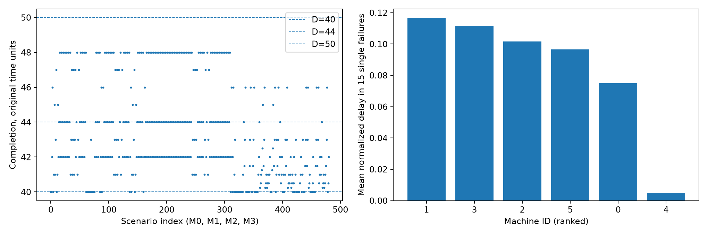
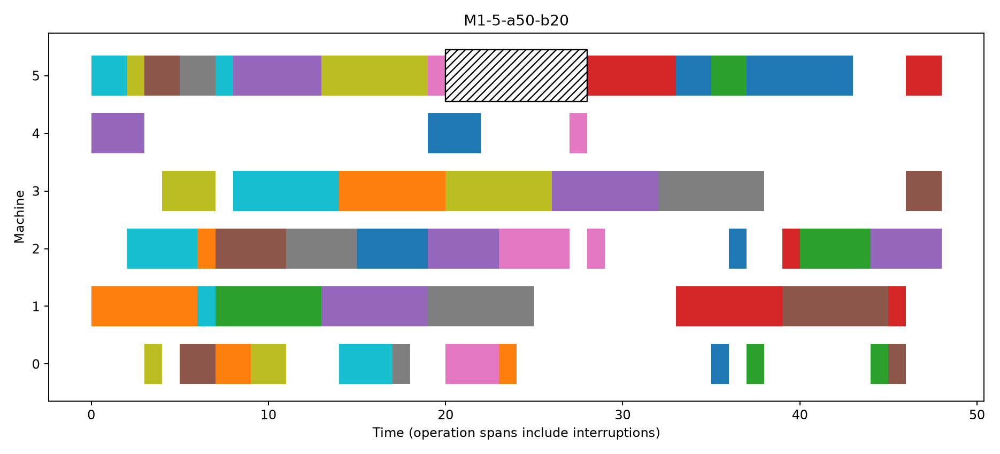

# Mk01: проверка исполнения фиксированного плана

Результат: **PASS**. [GitHub Actions](https://github.com/a-a-k/sheaft-tsfg-experiments/actions/runs/36230395401). Commit `75776d6c81806fdd2a53c8faf95e8283ef2409f6`.

Основной TSFG использует неизменённое Go-ядро S1, commit
`8510baf28673758f1e437d2dbc5a51ead9843a3b`, с новым адаптером фиксированных операций.
Самостоятельный C++ `grid` — вспомогательный контроль. Исходник S1 и его бинарник
не опубликованы; для воспроизведения участника `tsfg` нужен доступ к закрытому репозиторию.

CP-SAT: **OPTIMAL**, C0=40, нижняя граница
40; один поток, seed 20260926, лимит 120 с.
Одно расписание зафиксировано до всех сценариев. Δ=0,05; время хранится в целых ticks по 0,01.
Предел DIAGNOSTIC=500. Неизвестных полных сроков нет.

| Участник | Полные траектории | Проверки трёх сроков | Расхождения времён | Ложный успех / срыв |
|---|---:|---:|---:|---:|
| tsfg | 481 | 1443 | 0 | 0 / 0 |
| grid | 481 | 1443 | 0 | 0 / 0 |
| des | 481 | 1443 | 0 | 0 / 0 |
| dag | 481 | 1443 | 0 | 0 / 0 |
| simpy | 481 | 1443 | 0 | 0 / 0 |

Для каждого участника проверены 52 910 значений начала/окончания операций, баланс работы,
очерёдность станков, технологические зависимости, поступления и интервалы недоступности.
MISSION-проверки границ и цензурирование отдельно покрыты E0. В Mk01 исходы и FULL-метрики
получены проекцией одной полной траектории на каждый из трёх сроков; это не замер MISSION.
FULL-постпроцессор общий; его стоимость не используется для утверждений об ускорении.

Критические станки: [1, 3, 2]; контрольные: [4, 0, 5]. Ранжирование использует только
15 одинаковых одиночных отказов на станок, R, затем F при D=1,10C0, затем ID.
Оценка резервов и H5 в этот результат не входят.
Случаев, когда оба одиночных воздействия проходят срок, а пара его нарушает:
0 (с учётом трёх сроков). Все 225 пар и взаимодействия
I=C(A,B)−C(A)−C(B)+C0 сохранены в `pair_interactions.csv`.

Разбор каскада: `M1-5-a50-b20`, C=48 против C0=40.
Непосредственные зависимости задержанных операций сохранены в `cascade.json`.
Это вмешательства в данную модель, не доказательство причинности для реального производства.

Артефакты: `input/` содержит зафиксированные входы и SHA-256; `traces/` — полные времена
всех операций; `trajectories.csv`, `mission_outcomes.csv`, `mission_metrics.jsonl` — результаты;
`../build/` — окружение и происхождение сборок, `../e0/summary.json` — допуск E0.

**H3 не оценивалась.** Корректность на Mk01 не доказывает преимущества TSFG по времени или
памяти. E2–E4 и крупные серии требуют отдельного запуска по протоколу.
